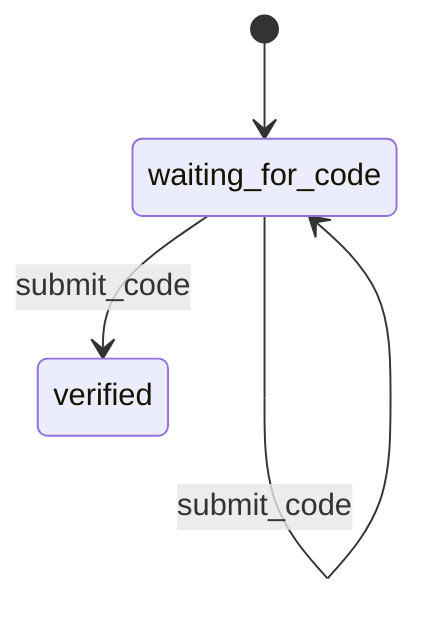

# trail

Typed, persistent workflows for Go.

Trail is for product flows that cannot finish in one request.

Start a flow, persist it, resume it later, and keep each step as normal typed Go code. It works well for onboarding, checkout, approvals, provisioning, account recovery, document review, subscription changes, and other flows where state matters.

The goal is not to be a big workflow platform. Trail gives you the useful parts: typed handlers, durable snapshots, allowed transitions, retries, and effect publishing.

Your application works with structs. Your database stores snapshots. Trail keeps the two sides in sync.

---

## Table of contents

- [Install](#install)
- [A workflow in 30 seconds](#a-workflow-in-30-seconds)
- [Why Trail exists](#why-trail-exists)
- [Define behavior on structs](#define-behavior-on-structs)
- [Handler signatures](#handler-signatures)
- [Transitions](#transitions)
- [Visualizing workflows](#visualizing-workflows)
- [Effects](#effects)
- [Transactions and consistency](#transactions-and-consistency)
- [Persistence](#persistence)
- [Idempotency](#idempotency)
- [Observability](#observability)
- [What Trail is not](#what-trail-is-not)
- [Production checklist](#production-checklist)
- [License](#license)

---

## Install

```sh
go get github.com/foxhq/trail
```

## A workflow in 30 seconds

```go
type VerifyData struct {
	UserID string
	Code   string
}

type VerifyInput struct {
	Code string
}

type SubmitCode struct {
	Code string
}

func (SubmitCode) Type() trail.ActionType {
	return "submit_code"
}

spec := trail.Define(
	trail.FlowType("verify_email"),
	func(ctx context.Context, begin trail.BeginContext, input VerifyInput) (*trail.Transition[VerifyData], error) {
		return trail.To("waiting_for_code", VerifyData{
			UserID: string(begin.SubjectID),
			Code:   input.Code,
		}), nil
	},
)

trail.Start(spec).MustGoTo("waiting_for_code")

trail.When(spec, "waiting_for_code", func(
	ctx context.Context,
	data VerifyData,
	action SubmitCode,
) (*trail.Transition[VerifyData], error) {
	if action.Code != data.Code {
		return trail.To("waiting_for_code", data), nil
	}
	return trail.Done("verified", data), nil
}).MustGoTo("waiting_for_code", "verified")

registry := trail.NewRegistry()
_ = trail.Register(registry, spec)

engine := trail.NewEngine(
	trail.NewMemoryStore(),
	registry,
)

started, err := engine.Begin(ctx, trail.BeginRequest{
	Type:      "verify_email",
	SubjectID: "user_123",
	Input:     VerifyInput{Code: "123456"},
})

done, err := engine.Submit(ctx, trail.SubmitRequest{
	FlowID: started.ID,
	Action: SubmitCode{Code: "123456"},
})
```

That is the whole loop:

```text
Begin(input) -> typed data + state
Submit(action) -> typed handler -> typed transition
Store -> durable snapshot
Result -> application response
```

## Why Trail exists

Most workflow code starts clean and then slowly becomes this:

- one table storing arbitrary JSON
- one state field
- one action field
- many `switch` statements
- repeated `json.Unmarshal`
- runtime type assertions
- hidden side effects
- no clear transition graph

Trail keeps the good part of finite state machines and removes the ceremony.

You define:

- the data type for the flow
- the begin input type
- the action types
- the allowed state transitions
- the side effects that should happen after commit

Trail handles:

- persistence snapshots
- typed handler dispatch
- optimistic concurrency
- idempotency
- lifecycle events
- effect dispatch

## Define behavior on structs

Small flows can use inline functions. Larger flows usually read better as structs.

```go
type VerifyEmailFlow struct {
	codes CodeService
}

func (f VerifyEmailFlow) Begin(
	ctx context.Context,
	begin trail.BeginContext,
	input VerifyInput,
) (*trail.Transition[VerifyData], error) {
	code := f.codes.New()

	return trail.To("waiting_for_code", VerifyData{
		UserID: string(begin.SubjectID),
		Code:   f.codes.Hash(code),
	}).WithEffects(SendVerificationEmail{
		UserID: string(begin.SubjectID),
		Code:   code,
	}), nil
}

func (f VerifyEmailFlow) SubmitCode(
	ctx context.Context,
	data VerifyData,
	action SubmitCode,
) (*trail.Transition[VerifyData], error) {
	if !f.codes.Check(data.Code, action.Code) {
		return trail.To("waiting_for_code", data), nil
	}
	return trail.Done("verified", data), nil
}

flow := VerifyEmailFlow{codes: codes}

spec := trail.Define(trail.FlowType("verify_email"), flow.Begin)

trail.Start(spec).MustGoTo("waiting_for_code")
trail.When(spec, "waiting_for_code", flow.SubmitCode).
	MustGoTo("waiting_for_code", "verified")
```

Read the setup as plain English:

```go
trail.Start(spec).MustGoTo("waiting_for_code")

trail.When(spec, "waiting_for_code", flow.SubmitCode).
	MustGoTo("waiting_for_code", "verified")
```

Start here. When this action happens here, run this method. These are the only states it may return.

## Handler signatures

Begin handlers receive the begin context and typed input:

```go
func(
	ctx context.Context,
	begin trail.BeginContext,
	input VerifyInput,
) (*trail.Transition[VerifyData], error)
```

Action handlers usually only need typed data and typed action:

```go
func(
	ctx context.Context,
	data VerifyData,
	action SubmitCode,
) (*trail.Transition[VerifyData], error)
```

If a handler needs flow metadata, use `WhenFlow`:

```go
trail.WhenFlow(spec, "waiting_for_code", flow.SubmitCodeWithFlow).
	MustGoTo("waiting_for_code", "verified")

func (f VerifyEmailFlow) SubmitCodeWithFlow(
	ctx context.Context,
	flow *trail.Flow[VerifyData],
	action SubmitCode,
) (*trail.Transition[VerifyData], error) {
	// flow has ID, Type, SubjectID, State, Metadata, Revision, ExpiresAt, etc.
	return trail.To(flow.State, flow.Data), nil
}
```

Use `When` by default. Reach for `WhenFlow` only when the flow metadata matters.

## Transitions

Handlers return transitions:

```go
return trail.To("waiting_for_code", data), nil
```

or completed transitions:

```go
return trail.Done("verified", data), nil
```

Transitions can expose public response data without changing persisted flow data:

```go
return trail.To("waiting_for_code", data).
	WithPublic(map[string]any{
		"resendAfter": data.ResendAfter,
	}), nil
```

And they can emit effects:

```go
return trail.Done("verified", data).
	WithEffects(SendVerificationEmail{UserID: data.UserID, Code: data.Code}), nil
```

## Visualizing workflows

Trail can turn declared transitions into a neutral graph model:

```go
graph, err := trail.GraphOf(spec)
```

or for every spec registered in a registry:

```go
graph, err := trail.GraphOfRegistry(registry)
```

Render it as Mermaid for docs, PRs, or CI artifacts:

```go
diagram := trail.Mermaid(graph)
fmt.Println(diagram)
```

Example output:



Keep this as developer tooling. Your production runtime does not need to serve diagrams. A clean pattern is a tiny command that builds the same registry your app uses and prints a graph:

```go
func main() {
	registry := buildWorkflowRegistry()

	graph, err := trail.GraphOfRegistry(registry)
	if err != nil {
		log.Fatal(err)
	}

	fmt.Print(trail.Mermaid(graph))
}
```

Then use it in docs or CI:

```sh
go run ./cmd/workflowviz > docs/workflows.mmd
```

The important part: the diagram comes from the same `Start(...).MustGoTo(...)` and `When(...).MustGoTo(...)` declarations the engine uses. No duplicated diagram config.

## Effects

Effects are how workflow code says, “this transition also produced work for the outside world.”

Use effects for:

- sending emails
- publishing webhooks
- enqueueing jobs
- writing audit records
- notifying another service

Do not send irreversible side effects directly inside workflow handlers. If the email succeeds but the snapshot fails to save, your system has already diverged.

```go
type SendVerificationEmail struct {
	UserID string
	Code   string
}

func (SendVerificationEmail) Type() trail.EffectType {
	return "send_verification_email"
}
```

For small services, register handlers with an in-process effect router:

```go
router := trail.NewEffectRouter(
	trail.OnEffect(func(ctx context.Context, effect SendVerificationEmail) error {
		return mailer.SendVerificationCode(ctx, effect.UserID, effect.Code)
	}),
)

if err := router.Validate(); err != nil {
	return err
}
```

Or use the fluent style:

```go
router := trail.NewEffectRouter().
	OnEffect(func(ctx context.Context, effect SendVerificationEmail) error {
		return mailer.SendVerificationCode(ctx, effect.UserID, effect.Code)
	})
```

Both styles are supported.

Package-level `trail.OnEffect(...)` gives compile-time generic checking. Fluent `router.OnEffect(...)` validates handler shape at setup/runtime because Go methods cannot declare their own type parameters.

If an effect needs the committed result, use `OnEffectWithResult`:

```go
router := trail.NewEffectRouter(
	trail.OnEffectWithResult(func(
		ctx context.Context,
		result trail.Result,
		effect SendVerificationEmail,
	) error {
		return audit.RecordEmailIntent(ctx, result.ID, effect.UserID)
	}),
)
```

Register the router with the engine:

```go
engine := trail.NewEngine(
	store,
	registry,
	trail.WithEffectSink(router),
)
```

For production systems, prefer an application-owned `EffectSink` that writes to your existing outbox, event table, message bus, or job queue. Trail does not own that infrastructure; it only calls your sink with the typed effects produced by the flow.

## Transactions and consistency

Trail exposes a small transaction boundary:

```go
type UnitOfWork interface {
	Do(ctx context.Context, fn func(ctx context.Context) error) error
}
```

When configured, `Begin`, `Submit`, and `Cancel` run inside that boundary. The same context is passed to:

- the Trail store
- the flow handler
- your application repositories used by the handler
- the effect sink
- the idempotency store

That lets the application decide what “atomic” means:

```go
engine := trail.NewEngine(
	store,
	registry,
	trail.WithUnitOfWork(appTx),
	trail.WithEffectSink(appOutbox),
)
```

The clean production pattern is:

- mutate domain entities immediately inside the handler or service it calls
- return effects only for external work such as email, SMS, webhooks, jobs, or integration events
- make the `EffectSink` persist those effect intents to the app’s existing outbox inside the same transaction
- let workers deliver the outbox asynchronously

If `EffectSink.Publish` fails, Trail returns `ErrEffectPublishFailed`. With a transactional `UnitOfWork`, the transaction can roll back the flow snapshot, domain writes, idempotency write, and outbox write together. With the default `NoopUnitOfWork`, there is no rollback boundary; use that only when this tradeoff is acceptable.

## Persistence

Trail storage is intentionally small:

```go
type Store interface {
	Create(context.Context, trail.Snapshot) error
	Get(context.Context, trail.FlowID) (trail.Snapshot, error)
	Update(context.Context, trail.Snapshot) error
	Delete(context.Context, trail.FlowID) error
}
```

`Update` must use optimistic concurrency with `Snapshot.Revision`. If the incoming revision is stale, return `trail.ErrFlowConflict`.

Optional extensions:

- `QueryStore` for dashboards, jobs, and operational tooling
- `CleanupStore` for retention cleanup
- `IdempotencyStore` for safe retries

The store only sees snapshots. Your handlers only see typed data.

## Idempotency

For APIs that may be retried, configure an idempotency store:

```go
engine := trail.NewEngine(
	store,
	registry,
	trail.WithIdempotencyStore(trail.NewMemoryIdempotencyStore()),
)
```

Then pass idempotency keys on begin or submit requests:

```go
result, err := engine.Submit(ctx, trail.SubmitRequest{
	FlowID:         flowID,
	Action:         SubmitCode{Code: "123456"},
	IdempotencyKey: "request_abc",
})
```

## Observability

Observers receive lifecycle events without changing workflow behavior:

```go
observer := trail.ObserverFunc(func(ctx context.Context, event trail.Event) {
	logger.Info("trail event",
		"name", event.Name,
		"flowId", event.Flow.ID,
		"type", event.Flow.Type,
		"state", event.Flow.State,
		"action", event.Action,
		"error", event.Error,
	)
})

engine := trail.NewEngine(
	store,
	registry,
	trail.WithObserver(observer),
)
```

Observers are for logs, metrics, tracing, and lightweight audit trails. They should not contain business logic and they should not be required for correctness.

Available event names:

- `EventBeginStarted`
- `EventBeginCompleted`
- `EventBeginFailed`
- `EventSubmitStarted`
- `EventSubmitCompleted`
- `EventSubmitFailed`
- `EventCancelStarted`
- `EventCancelCompleted`
- `EventCancelFailed`
- `EventEffectPublished`
- `EventEffectPublishFailed`

Observer failures must be handled inside the observer. Trail recovers observer panics so observability code does not break flow execution.

For metrics:

```go
observer := trail.ObserverFunc(func(ctx context.Context, event trail.Event) {
	metrics.Count("trail.event", 1,
		"event", string(event.Name),
		"type", string(event.Flow.Type),
		"state", string(event.Flow.State),
	)
})
```

For tracing:

```go
observer := trail.ObserverFunc(func(ctx context.Context, event trail.Event) {
	span := trace.SpanFromContext(ctx)
	span.AddEvent("trail."+string(event.Name), trace.WithAttributes(
		attribute.String("trail.flow_id", string(event.Flow.ID)),
		attribute.String("trail.flow_type", string(event.Flow.Type)),
		attribute.String("trail.state", string(event.Flow.State)),
		attribute.String("trail.action", string(event.Action)),
	))
})
```

## What Trail is not

Trail is not a BPMN engine. It is not a distributed saga framework. It is not a visual workflow builder.

Trail is for application workflows where Go code is the source of truth and the database stores durable progress.

That constraint is deliberate. It keeps the library small, predictable, and easy to reason about.

## Production checklist

- Use a real `Store` backed by your database.
- Implement `Update` with compare-and-swap revision checks.
- Use `IdempotencyStore` for public APIs.
- Use effects instead of direct side effects inside handlers.
- Use `WithUnitOfWork` when Trail participates in application transactions.
- Prefer an application outbox or durable event sink for important effects.
- Call `router.Validate()` during startup when using an `EffectRouter`.
- Keep persisted flow data serializable and versioned.

## License

MIT © 2026 Manifox Technology Solutions Co., Ltd.
